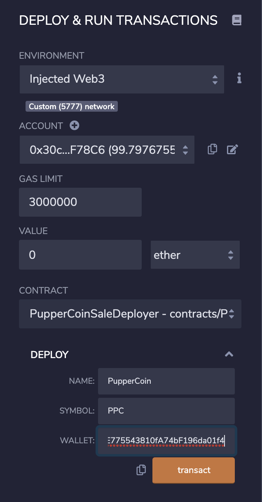
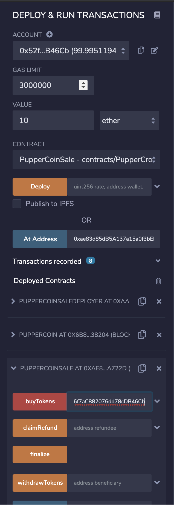
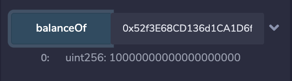
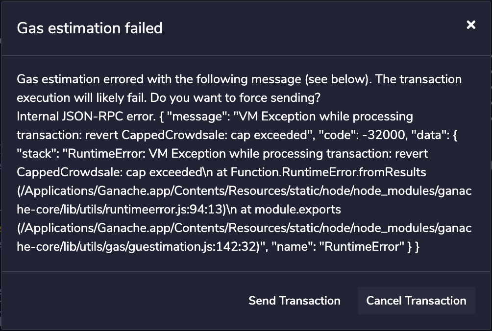
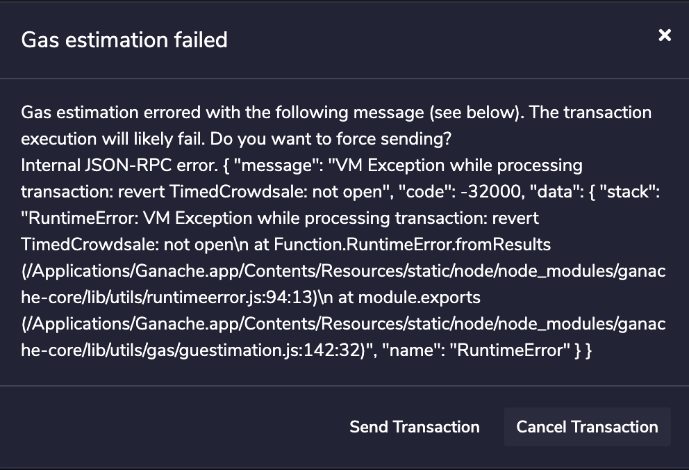
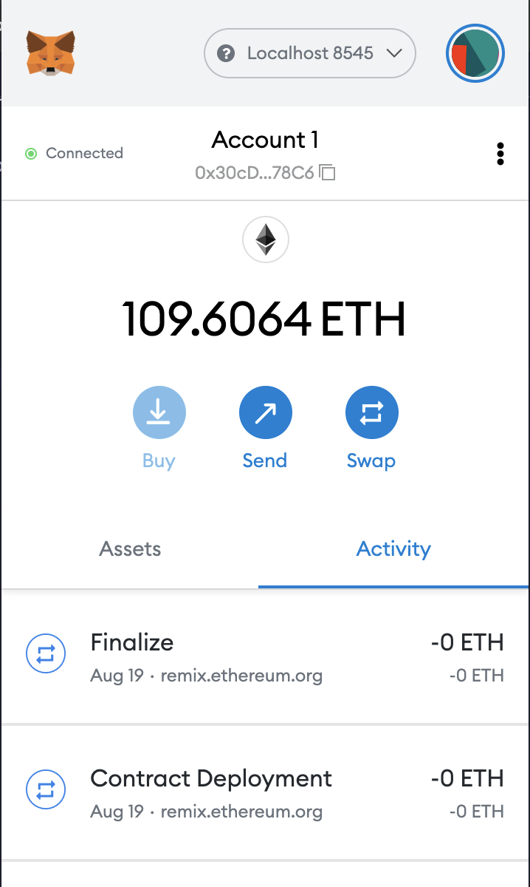
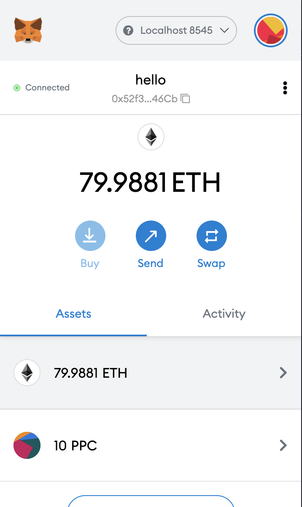
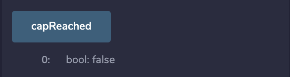
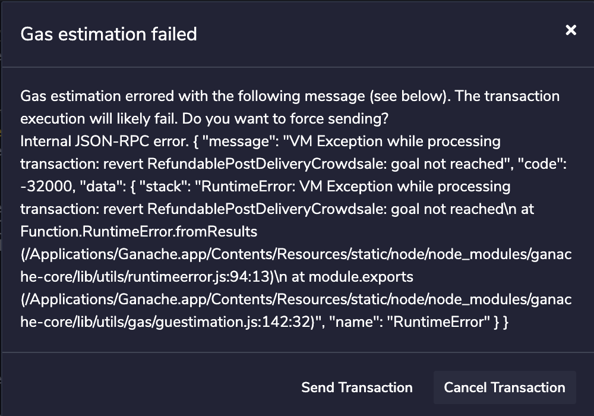
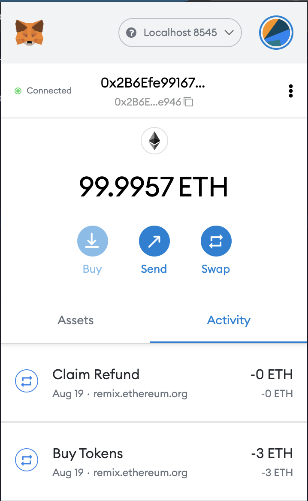

# 21-advanced-solidity

Please find the implementation of the smart contracts in the .sol files. For testing purposes, the cap will be set at 30 ETH, open for 10 minutes, and goal is set at 5 ETH. 

### Deploying Contract
1. We will be communicating using MetaMask, choose Inject Web3, desired wallet address and use the deployer to deploy the contracts

2. Once deployed, you will be able to see the token address and the token sale address. Use the At address function to add them to the list of deployed contracts.

### Participate in token sale
1. Buy some PPC tokens by sending eth to the token sale contract

2. view your balance

3. Since this is a capped sale, if you attempt to buy more than the cap, your transaction will not go through.

4. This is also a timed sale, if you attempt to buy when the sale is closed, your transaction will also not go through.

### Finalize - Cap Reached
1. Once the sale is closed, the sale can be finalized
2. The ETH gets deposited into the contract owner's address

3. Participant can withdraw tokens 

### Finalize - Cap not reached
1. Once the sale is closed, the owner can finalize the sale
2. The ETH doesn't get deposited into the contract owner's address in this case, since the cap is not reached

3. The status can be confirmed on remix.

4. Participants can not withdraw tokens in this case

5. Participants can refund their eth

This contract is also deployed on Ropsten: https://ropsten.etherscan.io/address/0xa74b3ec3c59fa65a4bee9c259522dacce3a6cb4c

Contract address: 0xA74B3eC3c59FA65a4BeE9c259522dAcCe3A6Cb4c
token sale address: 0xA3229dA422894b140c3A6FB4B709cA44A40ebB06
token address: 0xE18618f9523aD2Ec9CeC44AB3042752dF5AC0B71
